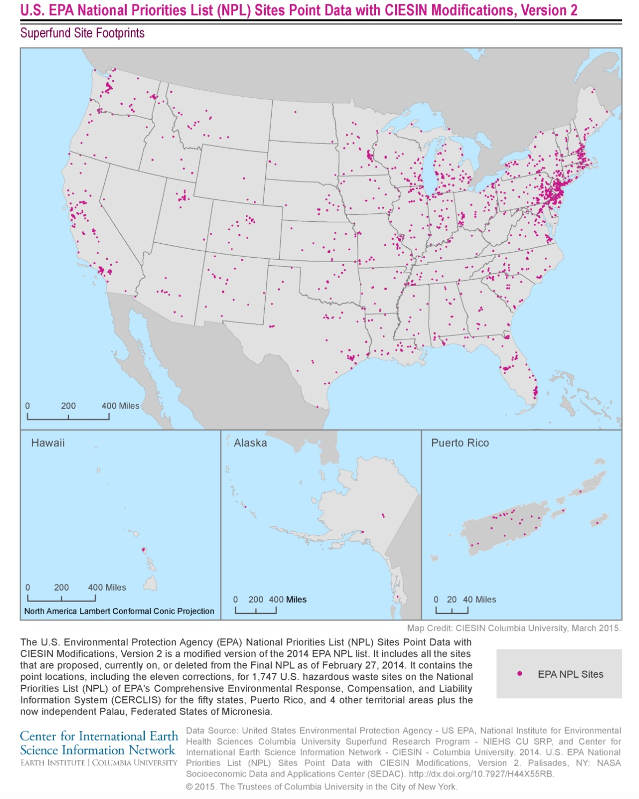
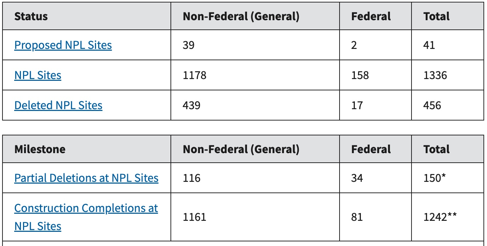

# NPL proximity metrics

A tool for calculate proximity-based exposure metrics for NPL (National Priorities List)

This tool is based on Lara Clark's work "exposure metrics for aircraft facilities"

# Superfund: National Priorities List

### Purpose:

The script calculates proximity-based (i.e., distance-based) exposure metrics for a specified list of receptor point locations (e.g., geocoded home addresses) to US NPL. This tool can be used to calculate the following proximity-based metrics within the US:

-   distance to nearest NPL facilities location from receptor

-   count of NPL facilities within a specified buffer distance of receptor

-   summary metrics of distances to all NPL facilities within a specified buffer distance of receptor (i.e., mean distance, mean of logarithm distance, and 25^th^, 50^th^, and 75^th^ percentile distances)

### 1. NPL Data set:

[NPL](https://www.epa.gov/superfund/superfund-national-priorities-list-npl) is the list of sites of national priority among the known releases or threatened releases of hazardous substances, pollutants, or contaminants throughout the United States and its territories.

{width="491"}

The NPL data include "Deleted NPL Site" in Green, "Proposed NPL Site" in Red and "NPL Site" in Yellow.

The data distribution:

{width="353"}

### Download

The NPL data set can be download at [here](https://sedac.ciesin.columbia.edu/data/set/superfund-epa-national-priorities-list-ciesin-mod-v2).

### Data format :

| Data                   | Image                           | Map                             | Web              |
|------------------|------------------|------------------|------------------|
| Microsoft Excel (.xls) | Portable Network Graphics (PNG) | Maps in Portable Document (PDF) | Web map services |

### Data sample :

Data set including Unique ID Name of site Street Address City Name County Name State Name Postal Code EPA Region Status on NPL Date of Status Geographic Latitude Geographic Longitude Additional Info URL to Site Profile Federal Ownership Status Date Data Last Updated

| EPA Site ID  | Site Name     | Address              | City     | State    | County | Postal Code | EPA Region | Status on NPL    | NPL Status Date | Latitude | Longitude  |
|------|------|------|------|------|------|------|------|------|------|------|------|
| MTN000802850 | SMURFIT-STONE | 14377 PULP MILL ROAD | MISSOULA | MISSOULA | MT     | 59808       | 8          | Proposed for NPL | 2013-05-24      | 46.96488 | -114.19782 |

### Spatial Domain:

Bounding Coordinates:

-   West Bounding Coordinate: -176.652500

-   East Bounding Coordinate: 151.783720

-   North Bounding Coordinate: 64.823000

-   South Bounding Coordinate: -14.360100

### 2. Receptor Data set

### Data format : CSV

### Columns :

| id       | number | street  | unit | city    | district | region | postcode | longitude | latitude | time_start | time_end |
|------|------|------|------|------|------|------|------|------|------|------|------|
| 11356887 | 5402   | 66TH ST |      | LUBBOCK |          | TX     | 79424    | -97.99003 | 30.36718 | 1976       | 1988     |

| id     | latitude | longitude |
|--------|----------|-----------|
| Unique | Number   | Number    |

### us_borders Data set

A simple feature collection with 6 features and 1 field

### Data format : rds

### Required columns :

| border                    | geometry       |
|---------------------------|----------------|
| us-canada MULTILINESTRING | ((2131787 8... |

**Resources**

------------------------------------------------------------------------

**Originator: United States Environmental Protection Agency - US EPA, National Institute for Environmental Health Sciences Columbia University Superfund Research Program - NIEHS CU SRP, and Center for International Earth Science Information Network - CIESIN - Columbia University**

### Parameters

#### required

receptor_filepath : path to the receptor file source_npl_facilities_filepath : path to npl file us_borders_filepath: path to us border file start_year : format YYYY ex:1985 start_year \< end_year end_year : format YYYY ex: 2020 start_year \< end_year npl_year: must be %Y-%m-%d format ex:'2017-10-01' start_year \< npl_year \< end_year

#### Optional:

NPL_Status : The npl site status used as a filter. Values : ["Proposed for NPL" "Currently on the Final NPL" "Deleted from the Final NPL"]

time_option : ["single_year_only"; "variable_year_only"; "either_single_or_variable_year"]

> ***NOTE:*** Currently only "single_year_only" been implemented.
